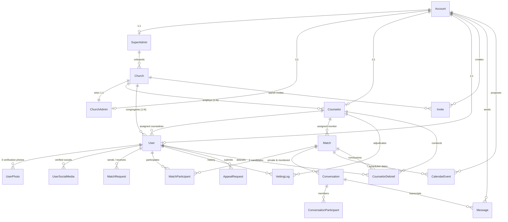
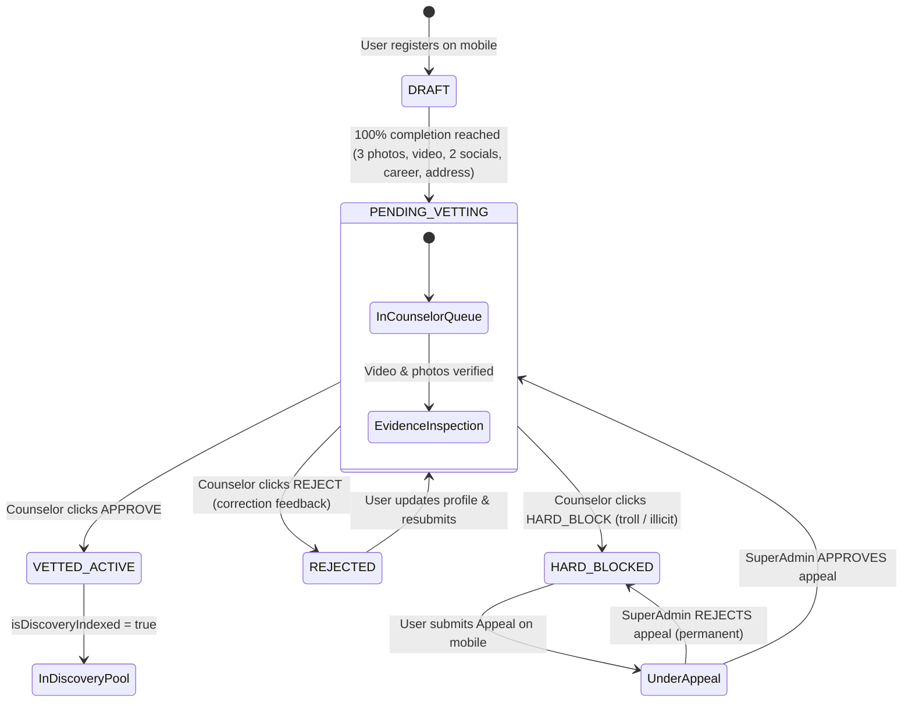
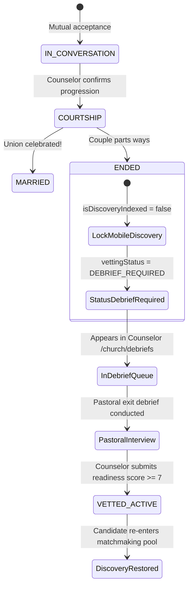

# Lifeline Platform — Database Schema, Data Models & RBAC Architecture Specification

> **Source of Truth Reference**:
> This document details the database architecture of the Lifeline faith-based matchmaking platform, strictly synchronized with [`backend/prisma/schema.prisma`](file:///c:/Users/hp/Documents/Personal%20Documents/Software-Development/clients/lifeline/backend/prisma/schema.prisma) and the 4-tier system RBAC model.

---

## Table of Contents
1. [Core Architectural Principles & Integrity Guards](#1-core-architectural-principles--integrity-guards)
2. [Role Hierarchy & Ecclesiastical Governance Model](#2-role-hierarchy--ecclesiastical-governance-model)
3. [Entity-Relationship (ER) Diagram](#3-entity-relationship-er-diagram)
4. [Complete Enum Catalog](#4-complete-enum-catalog)
5. [Complete Data Models & Table Schema](#5-complete-data-models--table-schema)
   - [5.1 Authentication Core (`accounts`)](#51-authentication-core-accounts)
   - [5.2 Role Profile Tables (`super_admins`, `church_admins`, `counselors`, `users`)](#52-role-profile-tables-super_admins-church_admins-counselors-users)
   - [5.3 Media & Social Identity (`user_photos`, `user_social_media`)](#53-media--social-identity-user_photos-user_social_media)
   - [5.4 Institutional Church Structure (`churches`, `invites`)](#54-institutional-church-structure-churches-invites)
   - [5.5 Matchmaking & Request Engine (`match_requests`, `matches`, `match_participants`)](#55-matchmaking--request-engine-match_requests-matches-match_participants)
   - [5.6 In-App Communications & Events (`conversations`, `conversation_participants`, `messages`, `calendar_events`)](#56-in-app-communications--events-conversations-conversation_participants-messages-calendar_events)
   - [5.7 Pastoral Safeguarding & Vetting Audit (`vetting_logs`, `appeal_requests`, `counselor_debriefs`)](#57-pastoral-safeguarding--vetting-audit-vetting_logs-appeal_requests-counselor_debriefs)
6. [RBAC Permissions Matrix & Safeguarding Firewall](#6-rbac-permissions-matrix--safeguarding-firewall)
7. [State Machines & Business Logic Lifecycles](#7-state-machines--business-logic-lifecycles)
   - [7.1 Vetting & Discovery Lifecycle](#71-vetting--discovery-lifecycle)
   - [7.2 Match Request (3-Slot Cap) & Auto-Supersession Lifecycle](#72-match-request-3-slot-cap--auto-supersession-lifecycle)
   - [7.3 Courtship Conclusion & Pastoral Debrief Loop](#73-courtship-conclusion--pastoral-debrief-loop)

---

## 1. Core Architectural Principles & Integrity Guards

1. **Relational Database Engine**: PostgreSQL with native UUID v4 generation (`dbgenerated("gen_random_uuid()")`) for all primary identifiers.
2. **Separation of Authentication from Identity Profiles**:
   - The central `accounts` table stores credentials (email, hashed password, OAuth provider tokens, phone) and the authoritative system `role`.
   - Role-specific attributes reside in discrete, dedicated tables linked via strict 1:1 foreign keys (`super_admins`, `church_admins`, `counselors`, `users`).
3. **Strict 1:1 Parish Governance Constraint**:
   - Each `Church` has exactly **one** authoritative `ChurchAdmin`. This is enforced at the database level via a unique constraint (`churchId @unique` on `ChurchAdmin`).
4. **Structural Exclusion of Staff from Matchmaking**:
   - `ChurchAdmin`, `Counselor`, and `SuperAdmin` have **no** relationship to `User` (the matchmaking dater profile). Staff accounts cannot be indexed into the candidate feed or receive match requests.
5. **Safeguarding Privacy Firewall**:
   - Sensitive financial brackets (`salaryRange`), exact street addresses (`residenceAddress`), and private dating criteria (`matchPreference`) are strictly firewalled. Parish leadership (`ChurchAdmin`) can inspect general congregational status but is barred from dating criteria to safeguard candidate dignity within their local faith community.

---

## 2. Role Hierarchy & Ecclesiastical Governance Model

The platform enforces a strict **4-tier system RBAC**:

```
                  ┌───────────────────────────────┐
                  │          SuperAdmin           │
                  │  (Global Platform Governance) │
                  └───────────────┬───────────────┘
                                  │ Manages & Onboards
                                  ▼
                  ┌───────────────────────────────┐
                  │          ChurchAdmin          │
                  │  (1:1 Parish Leader & Triage) │
                  │  Title: Pastor, Priest, Imam  │
                  └───────────────┬───────────────┘
                                  │ Appoints & Manages
                                  ▼
                  ┌───────────────────────────────┐
                  │           Counselor           │
                  │  (Spiritual Mentor & Vetting) │
                  └───────────────┬───────────────┘
                                  │ Vets, Monitors & Debriefs
                                  ▼
                  ┌───────────────────────────────┐
                  │             User              │
                  │ (End-User Dater on Mobile App)│
                  └───────────────────────────────┘
```

### The Ecclesiastical Leadership Model (Neutral Designation)
- Faith communities describe leadership differently: *Senior Pastor*, *Reverend Father*, *Imam*, *Resident Minister*, *Rabbi*, *General Overseer*, or *Parish Director*.
- The platform eliminates denominational bias by modeling the spiritual head directly as **`ChurchAdmin`** (the organizational leader), utilizing a customizable `title: String?` attribute (e.g., `"Senior Pastor"`, `"Reverend Father"`, `"Imam"`).
- There is **no separate `Pastor` role enum or table** in the schema.

---

## 3. Entity-Relationship (ER) Diagram



---

## 4. Complete Enum Catalog

| Enum Name | Allowed Values | Database Column Usage & Description |
|---|---|---|
| **`Role`** | `SuperAdmin`<br>`ChurchAdmin`<br>`Counselor`<br>`User` | `Account.role`<br>Authoritative platform permission gate. |
| **`ChurchModelType`** | `PARENT_BRANCH`<br>`INDIVIDUAL_PARISH` | `Church.churchModel`<br>`PARENT_BRANCH` supports custom branch input (e.g., RCCG). `INDIVIDUAL_PARISH` represents autonomous churches. |
| **`UserVettingStatus`** | `DRAFT`<br>`PENDING_VETTING`<br>`VETTED_ACTIVE`<br>`REJECTED`<br>`HARD_BLOCKED`<br>`DEBRIEF_REQUIRED` | `User.vettingStatus`<br>Controls discovery indexing, mobile profile lockdown, and counseling queues. |
| **`MatchStatus`** | `AWAITING_DECISIONS`<br>`WAITING_FOR_OTHER`<br>`MUTUAL_ACCEPTED`<br>`IN_CONVERSATION`<br>`COURTSHIP`<br>`MARRIED`<br>`ENDED`<br>`DECLINED`<br>`EXPIRED` | `Match.status`<br>Tracks relationship progression from mutual acceptance to courtship, marriage, or conclusion. |
| **`MatchRequestStatus`** | `PENDING`<br>`ACCEPTED`<br>`DECLINED`<br>`CANCELLED`<br>`SUPERSEDED` | `MatchRequest.status`<br>Active requests consume 1 of 3 concurrent slots. `SUPERSEDED` auto-cancels pending requests upon accepting another. |
| **`ChannelType`** | `COUPLE_PRIVATE`<br>`COUNSELOR_GROUP` | `Conversation.type`<br>`COUPLE_PRIVATE`: 1:1 chat between couple.<br>`COUNSELOR_GROUP`: 3-way/4-way channel with pastoral counselor oversight. |
| **`EventStatus`** | `PROPOSED`<br>`CONFIRMED`<br>`CANCELLED`<br>`COMPLETED` | `CalendarEvent.status`<br>Candidate date proposals requiring counselor public-safety confirmation. |
| **`SalaryRange`** | `RANGE_0_100K`<br>`RANGE_100K_500K`<br>`RANGE_500K_1M`<br>`RANGE_1M_PLUS` | `User.salaryRange`<br>Confidential financial brackets firewalled from general parish administration. |
| **`SubscriptionTierType`** | `free`<br>`premium` | `User.subscriptionTier`<br>Mobile dater subscription level (Kingdom Premium unlock). |
| **`SubscriptionPlanInterval`** | `MONTHLY`<br>`YEARLY` | `User.subscriptionInterval`<br>Billing frequency for recurring Paystack subscriptions. |
| **`SubscriptionStatusType`** | `active`<br>`past_due`<br>`expired`<br>`canceled` | `User.subscriptionStatus`<br>Subscription entitlement status. |
| **`StatusType`** | `pending`<br>`active`<br>`suspended`<br>`deleted` | `Account.status`, `Church.status`<br>Platform lifecycle state. |
| **`GenderType`** | `Male`<br>`Female` | `User.gender`<br>Strict binary opposite-gender matchmaking filter. |
| **`MatchPreferenceType`** | `my_church`<br>`my_church_plus`<br>`other_churches` | `User.matchPreference`<br>Denominational discovery boundary. |
| **`InviteType`** | `ChurchAdmin`<br>`Counselor`<br>`Church` | `Invite.type`<br>Target role for administrative onboarding tokens. |

---

## 5. Complete Data Models & Table Schema

### 5.1 Authentication Core (`accounts`)
The authoritative root table for identity, security credentials, tokens, and system permissions.

```prisma
model Account {
  id                          String          @id @default(dbgenerated("gen_random_uuid()")) @db.Uuid
  email                       String          @unique
  password                    String?         // Nullable for OAuth-only users
  authProvider                String          @default("local") // local, google, apple
  authProviderId              String?
  firstName                   String
  lastName                    String
  phone                       String?
  role                        Role
  status                      StatusType      @default(pending)

  // Verification & Security Tokens
  isEmailVerified             Boolean         @default(false)
  emailVerificationToken      String?         @unique
  emailVerificationExpiry     DateTime?
  emailVerificationLastSentAt DateTime?
  passwordResetToken          String?         @unique
  passwordResetExpiry         DateTime?

  createdAt                   DateTime        @default(now())
  updatedAt                   DateTime        @updatedAt

  // 1:1 Role Profile Extensions
  superAdmin                  SuperAdmin?
  churchAdmin                 ChurchAdmin?
  counselor                   Counselor?
  user                        User?

  // Relations
  invitesCreated              Invite[]        @relation("CreatedBy")
  messagesSent                Message[]
  eventsProposed              CalendarEvent[] @relation("ProposedBy")

  @@map("accounts")
}
```

---

### 5.2 Role Profile Tables

#### Platform Operator (`super_admins`)
```prisma
model SuperAdmin {
  id              String   @id @default(dbgenerated("gen_random_uuid()")) @db.Uuid
  accountId       String   @unique @db.Uuid

  account         Account  @relation(fields: [accountId], references: [id], onDelete: Cascade)
  churchesCreated Church[]

  @@map("super_admins")
}
```

#### Parish Head & Institutional Administrator (`church_admins`)
Enforces the **strict 1:1 constraint** with `Church` and stores ecclesiastical leadership designation.
```prisma
model ChurchAdmin {
  id        String   @id @default(dbgenerated("gen_random_uuid()")) @db.Uuid
  accountId String   @unique @db.Uuid
  churchId  String   @unique @db.Uuid // STRICT 1:1 UNIQUE CONSTRAINT WITH CHURCH
  title     String?  // e.g. "Senior Pastor", "Reverend Father", "Imam", "Resident Minister"

  account   Account  @relation(fields: [accountId], references: [id], onDelete: Cascade)
  church    Church   @relation(fields: [churchId], references: [id], onDelete: Cascade)

  @@map("church_admins")
}
```

#### Spiritual Mentor & Vetting Officer (`counselors`)
```prisma
model Counselor {
  id             String             @id @default(dbgenerated("gen_random_uuid()")) @db.Uuid
  accountId      String             @unique @db.Uuid
  churchId       String             @db.Uuid
  bio            String?

  account        Account            @relation(fields: [accountId], references: [id], onDelete: Cascade)
  church         Church             @relation(fields: [churchId], references: [id], onDelete: Cascade)
  assignedUsers  User[]             @relation("AssignedUsers")
  createdMatches Match[]            @relation("CounselorMatches")
  vettingLogs    VettingLog[]
  debriefs       CounselorDebrief[]

  @@index([churchId])
  @@map("counselors")
}
```

#### Mobile Dater / Candidate (`users`)
Contains all matchmaking, lifestyle, career, and vetting attributes.
```prisma
model User {
  id                          String                    @id @default(dbgenerated("gen_random_uuid()")) @db.Uuid
  accountId                   String                    @unique @db.Uuid
  gender                      GenderType
  dateOfBirth                 DateTime?

  // Progressive Onboarding & Discovery Gate
  onboardingStep              Int                       @default(1)
  profileCompletionPercentage Int                       @default(0)
  isDiscoveryIndexed          Boolean                   @default(false)
  vettingStatus               UserVettingStatus         @default(DRAFT)
  verificationNotes           String?
  whatsappNumber              String?

  // Parish Affiliation
  churchId                    String?                   @db.Uuid
  church                      Church?                   @relation("ChurchMembers", fields: [churchId], references: [id])
  branchName                  String?                   // For Parent-Branch models (e.g. RCCG Province/Parish)

  // Financial & Professional Integrity (Safeguarding Firewall: Hidden from ChurchAdmin)
  occupation                  String?
  salaryRange                 SalaryRange?

  // Geographic Footprint
  originCountry               String?
  originState                 String?
  originLga                   String?
  residenceCountry            String?
  residenceState              String?
  residenceCity               String?
  residenceAddress            String?                   // Hidden from ChurchAdmin
  residenceLatitude           Float?
  residenceLongitude          Float?
  residencePlaceId            String?
  residenceFormattedAddress   String?

  // Media & Discovery Criteria
  interests                   Json?
  matchPreference             MatchPreferenceType?      // Hidden from ChurchAdmin
  profilePictureUrl           String?
  videoIntroUrl               String?                   // Liveness introduction (<60s)
  videoDurationSeconds        Int?

  // Paystack Subscription Entitlement
  subscriptionTier            SubscriptionTierType      @default(free)
  subscriptionInterval        SubscriptionPlanInterval?
  subscriptionStatus          SubscriptionStatusType    @default(active)
  subscriptionExpiresAt       DateTime?

  // Pastoral Assignment & Vetting
  isVerified                  Boolean                   @default(false)
  verifiedAt                  DateTime?
  assignedCounselorId         String?                   @db.Uuid
  assignedCounselor           Counselor?                @relation("AssignedUsers", fields: [assignedCounselorId], references: [id])

  // Relations
  account                     Account                   @relation(fields: [accountId], references: [id], onDelete: Cascade)
  photos                      UserPhoto[]
  socialMediaHandles          UserSocialMedia[]
  sentRequests                MatchRequest[]            @relation("SentRequests")
  receivedRequests            MatchRequest[]            @relation("ReceivedRequests")
  matchParticipations         MatchParticipant[]
  vettingLogs                 VettingLog[]
  appealRequests              AppealRequest[]
  debriefs                    CounselorDebrief[]

  @@index([churchId])
  @@index([vettingStatus])
  @@index([isDiscoveryIndexed])
  @@map("users")
}
```

---

### 5.3 Media & Social Identity

#### Candidate Photos (`user_photos`)
Enforces the mandatory requirement of exactly 3 modest, filter-free verification photos.
```prisma
model UserPhoto {
  id        String   @id @default(dbgenerated("gen_random_uuid()")) @db.Uuid
  userId    String   @db.Uuid
  url       String
  order     Int      // 1, 2, or 3 (Strictly order 1-3)
  publicId  String?  // Cloudinary asset identifier
  createdAt DateTime @default(now())

  user      User     @relation(fields: [userId], references: [id], onDelete: Cascade)

  @@unique([userId, order])
  @@map("user_photos")
}
```

#### Social Media Verification (`user_social_media`)
Enforces the 2-of-3 verified social media rule (LinkedIn, Instagram, Facebook).
```prisma
model UserSocialMedia {
  id          String   @id @default(dbgenerated("gen_random_uuid()")) @db.Uuid
  userId      String   @db.Uuid
  platform    String   // LinkedIn, Instagram, Facebook
  handleOrUrl String
  createdAt   DateTime @default(now())

  user        User     @relation(fields: [userId], references: [id], onDelete: Cascade)

  @@index([userId])
  @@map("user_social_media")
}
```

---

### 5.4 Institutional Church Structure

#### Parish Registry (`churches`)
```prisma
model Church {
  id           String          @id @default(dbgenerated("gen_random_uuid()")) @db.Uuid
  officialName String
  aka          String?         // Acronym or familiar alias (e.g. "RCCG City of David")
  churchModel  ChurchModelType @default(INDIVIDUAL_PARISH)
  email        String          @unique
  phone        String

  // Address
  state        String
  lga          String?
  city         String?
  address      String?

  status       StatusType      @default(pending)
  createdBy    String          @db.Uuid
  creator      SuperAdmin      @relation(fields: [createdBy], references: [id])

  createdAt    DateTime        @default(now())
  updatedAt    DateTime        @updatedAt

  // 1:1 ChurchAdmin & Subordinate Personnel
  churchAdmin  ChurchAdmin?    // STRICT 1:1 WITH CHURCHADMIN
  counselors   Counselor[]     // 1:N
  members      User[]          @relation("ChurchMembers")
  invites      Invite[]

  @@map("churches")
}
```

#### Onboarding Invites (`invites`)
```prisma
model Invite {
  id                 String     @id @default(dbgenerated("gen_random_uuid()")) @db.Uuid
  token              String     @unique
  type               InviteType
  email              String

  churchId           String?    @db.Uuid
  church             Church?    @relation(fields: [churchId], references: [id], onDelete: Cascade)

  createdByAccountId String     @db.Uuid
  createdBy          Account    @relation("CreatedBy", fields: [createdByAccountId], references: [id])

  used               Boolean    @default(false)
  usedAt             DateTime?
  expiresAt          DateTime
  createdAt          DateTime   @default(now())
  updatedAt          DateTime   @updatedAt

  @@map("invites")
}
```

---

### 5.5 Matchmaking & Request Engine

#### 3-Slot Match Request Gate (`match_requests`)
Enforces the 3 concurrent active sent slots constraint.
```prisma
model MatchRequest {
  id           String             @id @default(dbgenerated("gen_random_uuid()")) @db.Uuid
  senderId     String             @db.Uuid
  receiverId   String             @db.Uuid
  status       MatchRequestStatus @default(PENDING)
  declinedAt   DateTime?
  supersededAt DateTime?
  createdAt    DateTime           @default(now())
  updatedAt    DateTime           @updatedAt

  sender       User               @relation("SentRequests", fields: [senderId], references: [id], onDelete: Cascade)
  receiver     User               @relation("ReceivedRequests", fields: [receiverId], references: [id], onDelete: Cascade)

  @@index([senderId, status])
  @@index([receiverId, status])
  @@map("match_requests")
}
```

#### Courtship Match Records (`matches`)
```prisma
model Match {
  id                 String             @id @default(dbgenerated("gen_random_uuid()")) @db.Uuid
  status             MatchStatus        @default(IN_CONVERSATION)
  counselorId        String?            @db.Uuid
  compatibilityScore Int?
  createdAt          DateTime           @default(now())
  endedAt            DateTime?

  counselor          Counselor?         @relation("CounselorMatches", fields: [counselorId], references: [id], onDelete: SetNull)
  participants       MatchParticipant[]
  conversations      Conversation[]
  calendarEvents     CalendarEvent[]
  debriefs           CounselorDebrief[]

  @@index([status])
  @@index([counselorId])
  @@map("matches")
}
```

#### Match Participants (`match_participants`)
```prisma
model MatchParticipant {
  id         String   @id @default(dbgenerated("gen_random_uuid()")) @db.Uuid
  matchId    String   @db.Uuid
  userId     String   @db.Uuid
  feedback   String?
  notes      String?
  createdAt  DateTime @default(now())
  updatedAt  DateTime @updatedAt

  match      Match    @relation(fields: [matchId], references: [id], onDelete: Cascade)
  user       User     @relation(fields: [userId], references: [id], onDelete: Cascade)

  @@unique([matchId, userId])
  @@index([userId])
  @@map("match_participants")
}
```

---

### 5.6 In-App Communications & Events

#### Communication Channels (`conversations`)
Supports both private 1:1 chat and 3-way monitored pastoral channels.
```prisma
model Conversation {
  id           String                    @id @default(dbgenerated("gen_random_uuid()")) @db.Uuid
  matchId      String                    @db.Uuid
  type         ChannelType
  createdAt    DateTime                  @default(now())
  updatedAt    DateTime                  @updatedAt

  match        Match                     @relation(fields: [matchId], references: [id], onDelete: Cascade)
  participants ConversationParticipant[]
  messages     Message[]

  @@index([matchId])
  @@map("conversations")
}
```

#### Channel Memberships (`conversation_participants`)
```prisma
model ConversationParticipant {
  id             String       @id @default(dbgenerated("gen_random_uuid()")) @db.Uuid
  conversationId String       @db.Uuid
  accountId      String       @db.Uuid
  roleInChat     String       // COUPLE_MEMBER, COUNSELOR, OBSERVER
  joinedAt       DateTime     @default(now())

  conversation   Conversation @relation(fields: [conversationId], references: [id], onDelete: Cascade)

  @@unique([conversationId, accountId])
  @@map("conversation_participants")
}
```

#### Messages (`messages`)
```prisma
model Message {
  id             String       @id @default(dbgenerated("gen_random_uuid()")) @db.Uuid
  conversationId String       @db.Uuid
  senderId       String       @db.Uuid
  content        String
  mediaUrl       String?
  readAt         DateTime?
  createdAt      DateTime     @default(now())

  conversation   Conversation @relation(fields: [conversationId], references: [id], onDelete: Cascade)
  sender         Account      @relation(fields: [senderId], references: [id], onDelete: Cascade)

  @@index([conversationId, createdAt])
  @@map("messages")
}
```

#### Dynamic Date Scheduler (`calendar_events`)
```prisma
model CalendarEvent {
  id           String      @id @default(dbgenerated("gen_random_uuid()")) @db.Uuid
  matchId      String      @db.Uuid
  proposedById String      @db.Uuid
  title        String
  description  String?
  startTime    DateTime
  endTime      DateTime
  status       EventStatus @default(PROPOSED)
  meetingLink  String?
  createdAt    DateTime    @default(now())
  updatedAt    DateTime    @updatedAt

  match        Match       @relation(fields: [matchId], references: [id], onDelete: Cascade)
  proposedBy   Account     @relation("ProposedBy", fields: [proposedById], references: [id], onDelete: Cascade)

  @@index([matchId])
  @@map("calendar_events")
}
```

---

### 5.7 Pastoral Safeguarding & Vetting Audit

#### Counselor Vetting Audit Trail (`vetting_logs`)
Timestamped log of every approval, rejection, or permanent disqualification.
```prisma
model VettingLog {
  id          String    @id @default(dbgenerated("gen_random_uuid()")) @db.Uuid
  userId      String    @db.Uuid
  counselorId String    @db.Uuid
  action      String    // APPROVED, REJECTED, HARD_BLOCKED
  reason      String?
  notes       String?
  createdAt   DateTime  @default(now())

  user        User      @relation(fields: [userId], references: [id], onDelete: Cascade)
  counselor   Counselor @relation(fields: [counselorId], references: [id], onDelete: Cascade)

  @@map("vetting_logs")
}
```

#### Dispute & Appeal Desk (`appeal_requests`)
Allows mobile daters disqualified with `HARD_BLOCKED` to petition SuperAdmin for reinstatement.
```prisma
model AppealRequest {
  id                     String   @id @default(dbgenerated("gen_random_uuid()")) @db.Uuid
  userId                 String   @db.Uuid
  appealReason           String
  status                 String   @default("PENDING") // PENDING, APPROVED, REJECTED
  reviewedBySuperAdminId String?  @db.Uuid
  createdAt              DateTime @default(now())
  updatedAt              DateTime @updatedAt

  user                   User     @relation(fields: [userId], references: [id], onDelete: Cascade)

  @@map("appeal_requests")
}
```

#### Relationship Exit Debriefs (`counselor_debriefs`)
Pastoral closure workspace for couples concluding courtships.
```prisma
model CounselorDebrief {
  id                    String    @id @default(dbgenerated("gen_random_uuid()")) @db.Uuid
  matchId               String    @db.Uuid
  userId                String    @db.Uuid
  counselorId           String    @db.Uuid
  notes                 String
  readinessScore        Int?      // 1 - 10 readiness assessment
  clearedForDiscoveryAt DateTime?
  createdAt             DateTime  @default(now())

  match                 Match     @relation(fields: [matchId], references: [id], onDelete: Cascade)
  user                  User      @relation(fields: [userId], references: [id], onDelete: Cascade)
  counselor             Counselor @relation(fields: [counselorId], references: [id], onDelete: Cascade)

  @@map("counselor_debriefs")
}
```

---

## 6. RBAC Permissions Matrix & Safeguarding Firewall

| Domain / Resource | `SuperAdmin` | `ChurchAdmin` (Leader) | `Counselor` | `User` (Mobile Dater) |
|---|---|---|---|---|
| **Churches** | Full CRUD | Read own parish; Edit via `PUT /churches/:id` | Read own parish | Read public list |
| **ChurchAdmins** | Full CRUD (enforces 1:1) | Update own profile / title | Read assigned leader | No access |
| **Counselors** | Full Read; Audit | Create & Assign for own church | Read & Update own bio | View assigned mentor |
| **Congregant Triage** | Read all | Assign unassigned congregants to counselors | View assigned caseload | No access |
| **User Dossier: General** | Full Access | Full Access | Full Access | View public profile |
| **User: Salary / Street Addr** | Full Access | **FIREWALLED (Redacted)** | **Full Access** (Assigned) | Self only |
| **User: Match Preferences** | Full Access | **FIREWALLED (Redacted)** | **Full Access** (Assigned) | Self only |
| **Vetting Adjudication** | Full Access | Step-in oversight | Primary Approver (`APPROVE`, `REJECT`, `BLOCK`) | Submit profile |
| **Monitored Group Chat** | Audit | Read oversight | Active Participant & Moderator | Active Participant |
| **Date Meetup Approval** | Audit | Read oversight | Confirms physical safety | Proposes date |
| **Exit Debrief Reset** | Audit | Read oversight | Conducts debrief; Resets status | Debriefed candidate |
| **Appeals Adjudication** | **Sole Authority** | No access | Provides original notes | Submits appeal |
| **Subscriptions (Revenue)**| Full Analytics & MRR | No access | No access | Paystack checkout |

---

## 7. State Machines & Business Logic Lifecycles

### 7.1 Vetting & Discovery Lifecycle



---

### 7.2 Match Request (3-Slot Cap) & Auto-Supersession Lifecycle

1. **3-Slot Concurrent Limit**:
   - A dater can maintain at most **3 active sent requests** simultaneously (`status: PENDING`).
   - Evaluated via `COUNT(MatchRequest WHERE senderId = :id AND status = 'PENDING') < 3`.
2. **First-Come Acceptance**:
   - When Candidate B accepts Candidate A's request:
     - `MatchRequest(A -> B)` updates to `ACCEPTED`.
     - `Match` and `Conversation` (`COUPLE_PRIVATE` and `COUNSELOR_GROUP`) records are instantiated.
3. **Auto-Supersession**:
   - All other active pending requests involving Candidate A or Candidate B (as sender or receiver) are automatically transitioned to `SUPERSEDED`.
   - Reclaims active request slots for other suitors without negative rejection feedback.

---

### 7.3 Courtship Conclusion & Pastoral Debrief Loop



---

*Document committed to repository as `guides/database_schema_and_roles.md`.*
